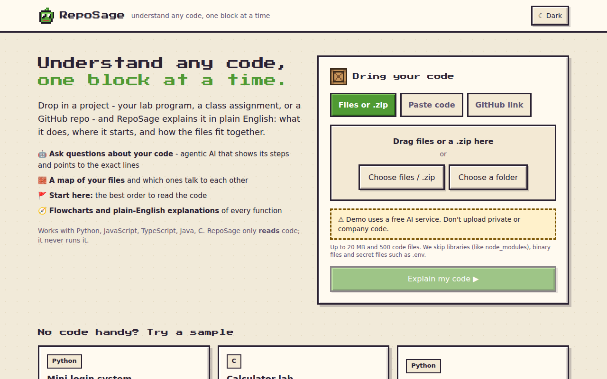
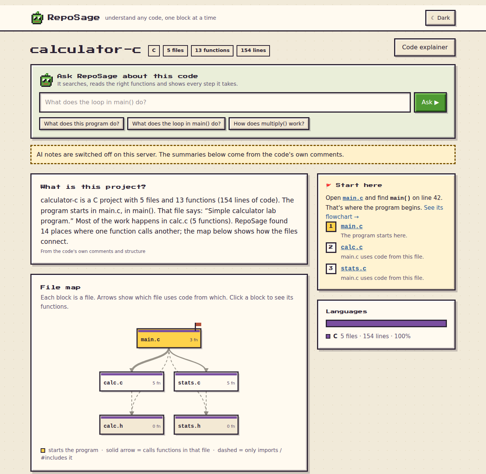
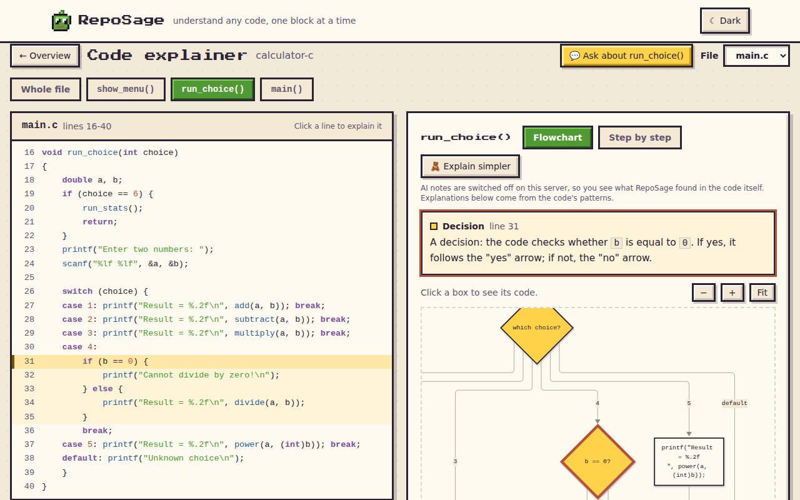
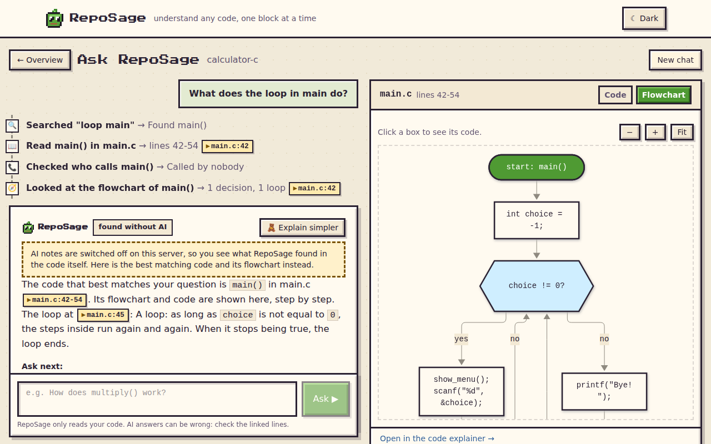
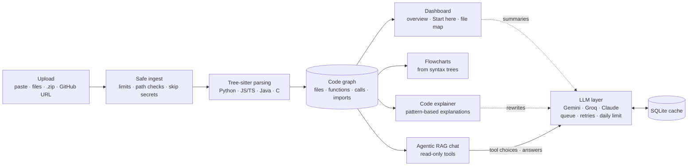

# RepoSage

**Upload a codebase and understand it: a file map, flowcharts of every function, plain-English explanations, and a chat agent that shows each step it takes and cites the exact lines.**

**Live demo:** https://reposage-n21l.onrender.com
<sub>Hosted on Render's free plan: the first visit after a quiet period can take about 30 seconds while the server wakes up. The demo uses a free AI service, so please don't upload private or company code.</sub>

| Upload | Dashboard |
|---|---|
|  |  |
| **Flowchart + explainer** | **Chat with agent steps** |
|  |  |

<sub>The screenshots were taken with AI switched off, so they show the parts of the app that work without any AI.</sub>

## The problem

Beginners often get code they didn't write, like a lab template, a group project or an open-source repo. Reading it top to bottom doesn't work, and asking a general chatbot gives answers they can't check. RepoSage shows them where the program starts, how the parts connect and what each function does, and every answer points back to the real lines of code.

## Features

- **Ask questions about your code.** An agent searches the code, reads functions and checks who calls whom, and shows each step live ("Searched 'divide' → Read `divide()` in calc.c → Checked who calls it"). Answers are in simple English with clickable `file:line` citations, an "Explain simpler" button and three follow-up questions.
- **Flowcharts of every function** for Python, JavaScript, TypeScript, Java and C. Click a box to highlight its code lines.
- **Code explainer:** the code on one side and a block-by-block explanation on the other, in a normal and a simpler version.
- **Dashboard:** a plain-English overview, a "Start here" reading order, a file map and one-line summaries of every file and function.
- **Four ways to upload:** paste code, pick files or a folder, upload a .zip, or give a public GitHub URL.
- **Works without AI.** The flowcharts, map, explanations and chat search all keep working when no AI is available.
- Light and dark mode, a phone layout, and an original pixel-art theme ("Blocky").

## Architecture



Uploaded code is unpacked into a per-project folder and parsed with Tree-sitter into a code graph of files, functions, classes, calls and imports. Everything up to and including the flowcharts is deterministic and needs no AI. The AI only adds summaries, rewrites explanations and drives the chat. All AI calls go through one small interface (`llm.py`), which hides which provider is used.

### How the chat agent picks its tools

1. **A free first step:** before any AI call, the question's keywords are searched (TF-IDF over the code, the AI summaries and a small list of beginner words such as "loop" → `for`/`while` and "menu" → `switch`). General questions also load the project overview.
2. **The AI picks the next tool through native function calling:** the tools are declared to the model as functions (Gemini `functionDeclarations`, OpenAI-style `tools` for Groq, `tool_use` for Claude): `search_code`, `read_function`, `read_file`, `find_callers`, `find_callees`, `get_flowchart`, `find_construct`, `glossary` and `project_overview`. Each tool has a required `why` argument, which is shown to the student and written to the server log. Each tool only reads the uploaded files and the code graph.
3. **Limits:** the agent may make at most 4 AI calls per question. It answers by calling `final_answer`; on its last turn that is the only tool offered (and forced where the provider supports it). A tool call it already made is refused.
4. **Checks:** citations that don't point to real lines in real files are removed before the answer is shown.
5. **Fallback:** if the AI is off, rate-limited or never answers, the same tools run without it, and the answer is the best matching code with its flowchart.

One provider-neutral message format is translated to each provider's function-calling API, so the same agent works with Gemini, Groq and Claude. Gemini's thought signatures are passed back unchanged between turns.

## Tech stack

| Area | Tools |
|---|---|
| Backend | Python 3.11, FastAPI, SQLite, Tree-sitter (Python, JavaScript, TypeScript, Java, C grammars) |
| Frontend | React 19, TypeScript, Vite, Tailwind CSS 4, Mermaid (flowcharts) |
| AI | Google Gemini (default, free tier), Groq (fallback), Anthropic Claude (optional), called over plain HTTPS |
| Hosting | Docker, Render (Blueprint in `render.yaml`) |
| Testing | `unittest`, FastAPI TestClient, Playwright for screenshots |

## Engineering highlights

- **Uploaded code is never run.** It is only read and parsed, and the server runs as a non-root user in Docker.
- **Upload safety:**
  - Limits of 20 MB per upload, 60 MB after unzipping, 500 code files and 1 MB per file.
  - Inside zips, absolute paths, `..`, drive letters and links are refused.
  - Each zip entry is read up to the limit, so a zip that lies about its sizes can't get around it.
  - `.env` files, keys, binaries and `node_modules` are skipped and never stored.
  - GitHub downloads are streamed with a size cap and are only accepted from `github.com` and `codeload.github.com`.
- **Flowcharts from syntax trees, with no AI.**
  - Covered: `if`/`elif`/`else`, `while`, `do`-`while`, for-each, `try`/`catch`, `return`/`break`/`continue`, and textbook counting loops (init → test → body → update).
  - The C `switch` follows the real rules: `case 2: case 3:` share one path, and a case without `break` falls into the next one.
  - The output is deterministic: the same code always gives the same chart.
- **Every feature works without AI.** Explanations are written from code patterns: for example, `scanf("%d", &choice)` becomes "Waits for the user to type something and stores it in `choice`". With AI the wording gets better; without it nothing breaks, and the page says so in plain words.
- **Switchable free-tier AI.** Gemini, Groq, Claude and a fake test provider sit behind one interface and are chosen with environment variables, with no code changes.
  - Requests to a provider are sent one at a time and spaced out.
  - On "slow down" errors (HTTP 429/503) it waits as long as the provider asks, then retries.
  - Requests are counted per day, and the fallback provider is used when the main one runs out.
  - Every answer is cached in SQLite, and AI output that isn't valid JSON is never cached.
- **C support across files:** a call in `main.c` to a function declared in `calc.h` is linked to its body in `calc.c`.
- **Stress run:** the flowchart builder was run over all 4,004 functions of two open-source projects ([ky](https://github.com/sindresorhus/ky) in TypeScript and [gson](https://github.com/google/gson) in Java) plus RepoSage's own Python code. Every function got a flowchart, with no crashes, and every box was reachable from the start. The first run found one Java construct it didn't handle (compact record constructors), which is now fixed.
- **135 automated tests:**
  - 62 for the web app: upload safety, the AI queue and fallback, AI error handling against fake Google servers, flowcharts in all five languages, the chat agent's step limit and citation checks.
  - 73 for the analysis engine and the Claude Code plugin (1 skipped).
  - All of them use a fake AI provider and need no network.

## Run locally

Requirements: Python 3.11+ and Node.js 20+.

```bash
# 1. Backend (FastAPI on http://localhost:8000)
cd webapp/backend
python3 -m venv .venv
.venv/bin/pip install -r requirements.txt
AI_PROVIDER=fake .venv/bin/uvicorn app.main:app --reload

# 2. Frontend (second terminal; http://localhost:5173, forwards /api to :8000)
cd webapp/frontend
npm install
npm run dev
```

Or run `npm run build` once; the backend then serves the built app on port 8000.

`AI_PROVIDER=fake` runs everything offline with canned AI answers. To use a real model, set `AI_PROVIDER` and the matching key as environment variables (keys are never sent to the browser):

| Variable | Purpose |
|---|---|
| `AI_PROVIDER` / `AI_FALLBACK` | `gemini` (default), `groq`, `anthropic` or `fake` |
| `GEMINI_API_KEY`, `GROQ_API_KEY`, `ANTHROPIC_API_KEY` | API keys |
| `AI_DAILY_LIMIT`, `AI_MIN_INTERVAL_SECONDS` | stay inside free-tier limits |
| `CHAT_MAX_AI_CALLS` | AI calls per chat question (default 4) |

The full list is in [webapp/README.md](webapp/README.md).

**Sample projects:** the upload page has one-click samples in `webapp/samples/`: a small Python login system, a C calculator lab (menu, `switch`-`case`, loops, arrays) and a Python to-do list.

**Tests:**

```bash
cd webapp/backend && .venv/bin/python -m unittest discover -s tests -t .   # web app
python -m unittest discover -s tests -t .                                  # engine + plugin (repo root,
                                                                           # needs requirements-plugin.txt)
```

**Deploy:** in Render, choose New → Blueprint and pick this repository. Render reads `render.yaml` and builds the `Dockerfile`, then asks for the API keys.

## Repository layout

```
webapp/backend/     FastAPI app: ingest, analysis, flowcharts, explainer, chat agent, LLM layer
webapp/frontend/    React + TypeScript app
webapp/samples/     sample projects used by the demo and the tests
reposage/           analysis engine: Tree-sitter parsers, code graph, search
                    (also packaged as a Claude Code plugin; see the plugin-version branch)
tests/              tests for the engine and the plugin
docs/               images for this README and the earlier static demo
app.py, engine.py   the first prototype (single-file FastAPI + Python ast)
```

## Known limitations

- Search is keyword-based (TF-IDF), not embeddings, so questions that use none of the code's words can miss. The agent's follow-up tool calls and the beginner-word list help with that.
- AI answers can be wrong. That is why every claim cites lines you can click and check.
- On the free hosting plan, uploaded projects and the AI cache are cleared when the server restarts.

## Roadmap

- **"Play the Program" game mode:** the code graph becomes a pixel-art world (folders are regions, files are villages, functions are buildings, calls are roads). Students follow their data through the program and talk to functions. Python traces would run in the student's own browser with Pyodide, never on the server. A [mockup](webapp/mockups/world.html) is generated from a real code graph.
- **Beginner helpers:** hover explanations for terms like "function", "loop" and "array".
- **More languages:** C++ and Go are next. Each language is one parser class in the engine (`reposage/parsers/`).

## Credits

Inspired by [Understand Anything](https://github.com/Egonex-AI/Understand-Anything). RepoSage's code, design and artwork are original.

## Author

**Mehwish Afsa**
- LinkedIn: [linkedin.com/in/mehwishafsa](https://www.linkedin.com/in/mehwishafsa/)
- Email: [mehwishafsa44@gmail.com](mailto:mehwishafsa44@gmail.com)

Released under the [MIT License](LICENSE).
